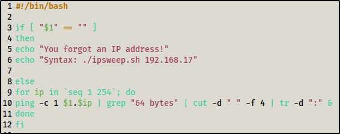

# Bash Scripting

### Scripting with Bash

* cat \<filename> | grep “\<text in the files>” - search for a word in a file
* example : cat ip.txt | grep "64 bytes" | cut -d " " -f 4 | tr -d ":”
  * cut = to cut words
  * tr = translate
  * \-d = delimeter
  * \-f = field
* \#!/bin/bash = shebang (start on sh script)
*

    <figure><figcaption>
Example IP Sweep script
</figcaption></figure>
